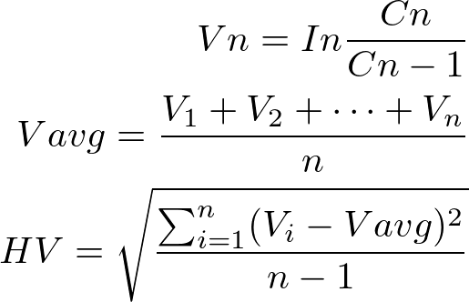

 - `analizer` : 業種・市場を分析
 - `bollinger_band_counter` : 複数銘柄の最新の終値のボリンジャーバンドを集計
 - `code_acqusition` :  選択したカテゴリーの全てのコードを取得
 - `dataframe_slicer` : DataFrameを任意の数に分ける
 - `download_update` : 最新の上場銘柄一覧をダウンロード
 - `generate_schedule` : スケジュールを作成
 - `historical_volatirity` : ヒストリカルボラティリティを計算
 - `loading` : ローディングを実装
 - `market_data_acquisition` : `code_acqusition`の拡張版で、コードだけでなく価格や出来高を取得
 - `stock_data_acquisition` : 任意の銘柄の始値や終値などを取得
 - `text_length_counter` : 全角・半角の長さを取得

***

### `generate_schedule`

 - `fill(True)`：`0`で埋めるかどうかを指定できます。
 - `addition`：時間を追加できます。「`'09:05'`, `'9:5'`」のどちらでも指定可能です。
 - `delete`：関数によって生成された時間の中で、必要のない時間をあらかじめ選択できます。
 - `step(30)`：分の間隔を指定できます。`1～59`までの値を取ります。
 - `delimiter(':')`：時間と分を区切る文字を指定できます。ここに空の文字列を入れることはできません。
 - `include(True)`：ここを`False`にした場合は`range(9, 15)`としたときの15が追加されません。

##### ※カッコの中はデフォルトの値を示しています。

```python
>>> generate_schedule(range(9, 12), step=20)
['09:00', '09:20', '09:40', '10:00', '10:20', '10:40', '11:00', '11:20', '11:40', '12:00']

>>> generate_schedule(range(8, 10), fill=False, include=False)
['8:0', '8:30', '9:0', '9:30']

>>> generate_schedule(range(9, 11), addition=['09:05'])
['09:00', '09:05', '09:30', '10:00', '10:30', '11:00']

>>> generate_schedule(range(9, 15), delete=['11:30', '12:00', '12:30'])
['09:00', '09:30', '10:00', '10:30', '11:00', '13:00', '13:30', '14:00', '14:30', '15:00']

>>> generate_schedule(range(3, 6), delimiter="-")
['03-00', '03-30', '04-00', '04-30', '05-00', '05-30', '06-00']
```

***


